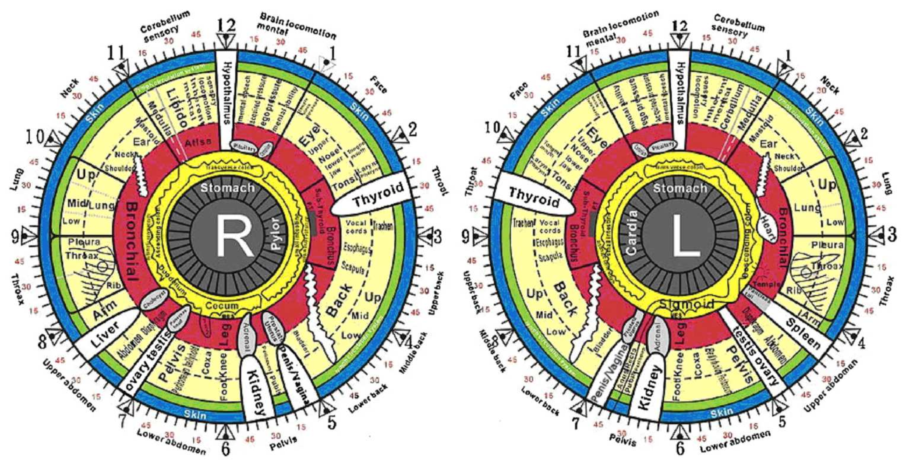

# Discovering Informative Regions in Iris Images to Predict Diabetes

This work contains codes and datasets corresponding to detecting Informative regions in iris images related to diabetes.



# Usage
 - Create a python environment and run "pip install -r requirement.txt"
 - Unzip Data.zip. it contains compact version of preprocessed iris images based on different splittings
 (Right eye/ Left eye/ person-based).
    - Some useful preprocessing modules are in "pre processing" folder.
 - Run Main.py

# Dataset
  - 88 diabetic and 108 control cases
  - The diabetic subjects were interviewed about their diabetes type, controlling manner and the stage of diabetic retinopathy if existed (for further investigations). The protocol used for data acquisition was under the supervision of Ophthalmologists of Farabi Hospital.
  - download dataset from [here](https://drive.google.com/file/d/1y7W84iMXkXcL7pnS-wkN2I5V5VIvZrci/view?usp=sharing).


# Citation
If you use this dataset or this code base in your work, please cite
```
@inproceedings{iridology-icbme2018,
  author    = {Parsa Moradi and Naghme Nazer and Amirhosein Khasahmadi and Hoda Mohammadzadeh and Hasan Khojasteh Jafari},
  title     = {Discovering Informative Regions in Iris Images to Predict Diabetes},
  booktitle = {In 2018 25th National and 3rd International Iranian Conference on Biomedical Engineering (ICBME)},
  year      = {2018},
}
```

# Contact
For questions about our paper or code, please contact [Naghme Nazer](mailto:naghme93@gmail.com) or [Parsa Moradi](mailto::parsa.moradi73@gmail.com).
